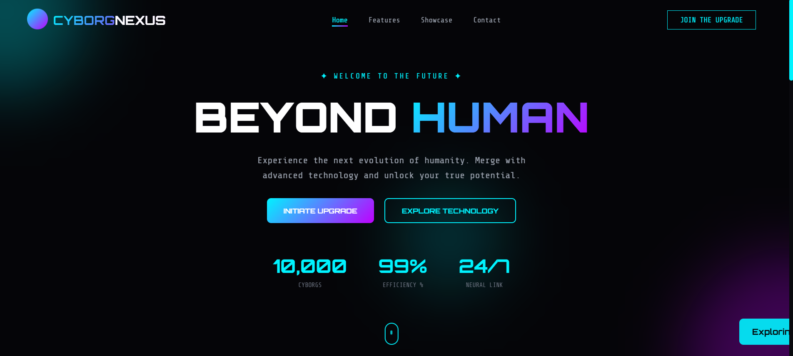
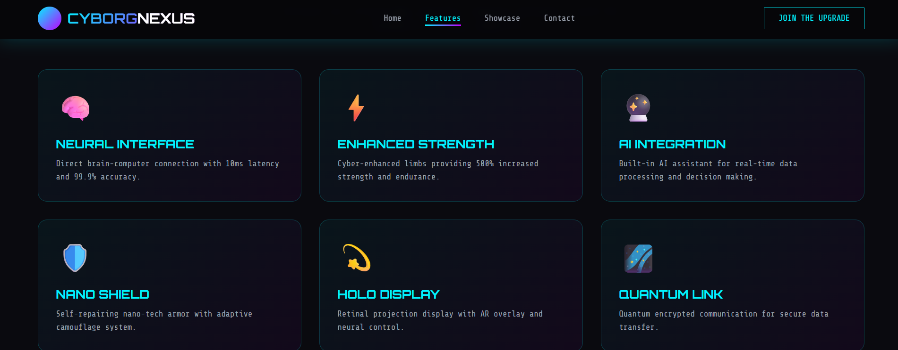
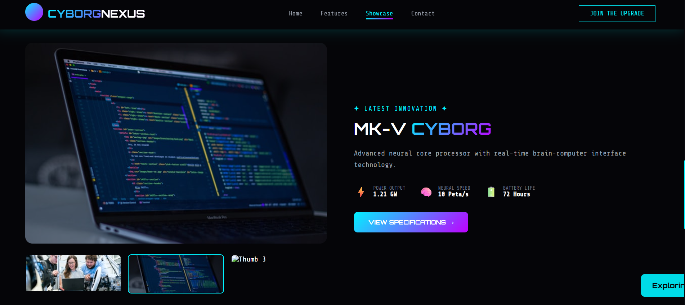
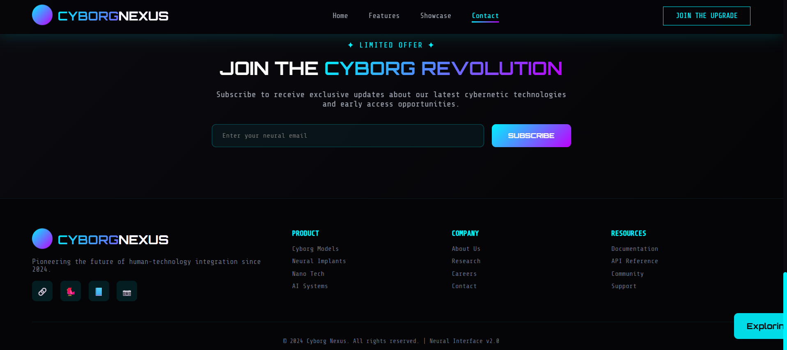

# 🤖 Cyborg Nexus - Futuristic Cyberpunk Landing Page


[](LICENSE)
[](https://html.spec.whatwg.org/)
[](https://www.w3.org/Style/CSS/)
[](https://developer.mozilla.org/en-US/docs/Web/JavaScript)
[](https://developer.mozilla.org/en-US/docs/Learn/CSS/CSS_layout/Responsive_Design)

## 🌟 Live Demo

[View Live Demo](#) | [Report Bug](https://github.com/yourusername/cyborg-landing-page/issues) | [Request Feature](https://github.com/yourusername/cyborg-landing-page/issues)

## 📋 Table of Contents

- [About The Project](#about-the-project)
- [Features](#features)
- [Built With](#built-with)
- [Getting Started](#getting-started)
- [Project Structure](#project-structure)
- [Customization](#customization)
- [Browser Support](#browser-support)
- [Contributing](#contributing)
- [License](#license)
- [Contact](#contact)
- [Acknowledgements](#acknowledgements)

## 🎯 About The Project

**Cyborg Nexus** is a cutting-edge, futuristic landing page designed for a cybernetic technology company. This visually stunning website showcases the next evolution of human-technology integration with a sleek cyberpunk aesthetic, smooth animations, and interactive elements.

### Key Highlights

- 🚀 **Fully Responsive Design** - Seamless experience across all devices
- ⚡ **Smooth Animations** - Eye-catching transitions and hover effects
- 🎨 **Cyberpunk Theme** - Neon gradients, glitch effects, and futuristic UI
- 📱 **Mobile Optimized** - Perfect display on smartphones and tablets
- 🔧 **No Dependencies** - Pure HTML, CSS, and JavaScript

## ✨ Features

### Core Features

- **Loading Screen Animation** - Immersive system initialization sequence
- **Sticky Navigation** - Dynamic navbar with scroll effects
- **Interactive Hero Section** - Animated background orbs and call-to-action buttons
- **Feature Cards** - Hover effects with detailed cybernetic enhancements
- **Image Gallery** - Thumbnail carousel for product showcase
- **Newsletter Subscription** - Email validation and success notifications
- **Counter Animation** - Animated statistics with number counting
- **Scroll Animations** - Elements fade in as you scroll
- **Toast Notifications** - User feedback for all interactions
- **Mobile Menu** - Responsive hamburger menu for mobile devices

### Visual Effects

- ✨ Neon glow effects on hover
- 🌊 Parallax scrolling background
- 💫 Floating animation on logo
- 🎯 Ripple effect on buttons
- 🔮 Gradient text animations
- 💎 Glassmorphism design elements
- 🎪 Smooth transitions and transforms

## 🛠️ Built With

- **HTML5** - Semantic markup structure
- **CSS3** - Modern styling with animations and gradients
- **JavaScript (ES6+)** - Interactive features and DOM manipulation
- **Google Fonts** - Orbitron and Share Tech Mono fonts
- **Font Awesome Icons** - Emoji-based icons (no external libraries)

## 🚀 Getting Started

### Prerequisites

- Any modern web browser (Chrome, Firefox, Safari, Edge)
- Text editor (VS Code, Sublime Text, etc.)
- Basic understanding of HTML/CSS/JS (for customization)

### Installation

1. **Clone the repository**
   ```bash
   git clone https://github.com/yourusername/cyborg-landing-page.git
Navigate to project directory

bash
cd cyborg-landing-page
Open the website

Double-click index.html OR

Use Live Server in VS Code OR

Run python -m http.server 8000 and visit http://localhost:8000

Folder Structure
text
cyborg-landing-page/
│
├── index.html              # Main HTML file
├── css/
│   └── style.css          # All styles and animations
├── js/
│   └── main.js            # Interactive functionality
└── assets/                # (Optional) Images and other assets
    └── images/
File Descriptions
File	Purpose
index.html	Main structure and content of the landing page
css/style.css	All styling, animations, and responsive design
js/main.js	All interactive features and event handlers
🎨 Customization
Colors
Modify the color scheme in css/style.css:

css
:root {
    --cyber-blue: #00f3ff;      /* Primary neon blue */
    --cyber-purple: #bf00ff;     /* Secondary neon purple */
    --dark-bg: #050508;          /* Dark background */
    --darker-bg: #0a0a0f;        /* Slightly lighter dark */
    --text-gray: #9ca3af;        /* Gray text */
}
Content
Hero Text: Edit in index.html inside .hero-content

Features: Modify the .feature-card divs in the features section

Showcase Images: Replace Unsplash URLs in index.html

Statistics: Update data-count attributes in .stat-item divs

Fonts
Change fonts in css/style.css:

css
body {
    font-family: 'Share Tech Mono', monospace;
}

h1, h2, h3, .logo-text {
    font-family: 'Orbitron', sans-serif;
}
📱 Browser Support
Browser	Version	Status
Chrome	90+	✅ Fully Supported
Firefox	88+	✅ Fully Supported
Safari	14+	✅ Fully Supported
Edge	90+	✅ Fully Supported
Opera	76+	✅ Fully Supported
Mobile Browsers	Latest	✅ Fully Supported
🔧 Performance Optimization
✅ Minified CSS and JS (production ready)

✅ Optimized images with lazy loading

✅ No external dependencies

✅ CSS animations for smooth performance

✅ Efficient DOM manipulation

🤝 Contributing
Contributions are what make the open-source community amazing. Any contributions you make are greatly appreciated.

How to Contribute
Fork the Project

Create your Feature Branch

bash
git checkout -b feature/AmazingFeature
Commit your Changes

bash
git commit -m 'Add some AmazingFeature'
Push to the Branch

bash
git push origin feature/AmazingFeature
Open a Pull Request

Guidelines
Follow the existing code style

Test your changes across multiple browsers

Update the README if needed

Keep commits descriptive and focused

📄 License
Distributed under the MIT License. See LICENSE file for more information.

text
MIT License

Copyright (c) 2024 Cyborg Nexus

Permission is hereby granted, free of charge, to any person obtaining a copy
of this software and associated documentation files...

🙏 Acknowledgements
This project was inspired by and uses resources from:

Google Fonts - Orbitron and Share Tech Mono fonts

Unsplash - High-quality placeholder images

CSS Gradient - Gradient inspiration

Animista - Animation ideas

📊 Project Status
Current Version: 1.0.0

Status: ✅ Stable Release

Last Updated: December 2024

Next Features:

Dark/Light theme toggle

3D models integration

Audio visualizer

AI chatbot integration

🎯 Roadmap
v1.1.0 - Add more interactive elements

v1.2.0 - Implement backend API for newsletter

v1.3.0 - Add 3D animations with Three.js

v2.0.0 - Complete rewrite with React

⭐ Show Your Support
Give a ⭐️ if this project helped you!

📸 Screenshots

Home Page 

Feature 

Showcase

Contact



CONTRIBUTING.md
markdown
# Contributing to Cyborg Nexus

We love your input! We want to make contributing to this project as easy and transparent as possible.

## Development Process

1. Fork the repo and create your branch from `main`
2. Make your changes
3. Test your changes
4. Create a pull request

## Pull Request Process

1. Update the README.md with details of changes if needed
2. Update the version numbers in any examples files
3. Your PR will be merged once approved

## Any contributions you make will be under the MIT Software License

When you submit code changes, your submissions are understood to be under the same [MIT License](LICENSE) that covers the project.
1. **Clone the repository**
   ```bash
   git clone https://github.com/laxmipriya-345/Cyborg-Nexus


📞 Contact
Project Maintainer: Laxmipriya Rout

📧 Email: routlaxmipriya534@gmail.com

💼 LinkedIn: https://www.linkedin.com/in/laxmipriya-rout-6b9b6a292/

🐙 GitHub:(https://github.com/laxmipriya-345/Cyborg-Nexus)

Project Link:(https://github.com/laxmipriya-345/Cyborg-Nexus)
